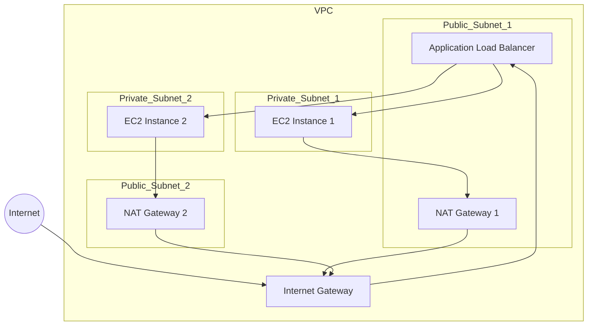

# AWS Secure Web Application Infrastructure (Terraform)

A secure, highly available web application infrastructure deployed on AWS using Terraform modules.

## 🎯 Overview
This project provides infrastructure as code for:
- Load-balanced web application
- Multi-AZ deployment
- Secure networking configuration
- Automated infrastructure provisioning

## 🏗️ Architecture

### Core Components
- **Network Layer**: VPC, Subnets (Public/Private), IGW, NAT
- **Application Layer**: EC2 instances, Load Balancers
- **Security Layer**: Security Groups, Access Controls
- **State Management**: S3, DynamoDB

### Infrastructure Layout
### Infrastructure Layout


### Project Structure
```
.
├── main.tf                 # Main Terraform configuration
├── variables.tf            # Input variables
├── outputs.tf             # Output values
├── terraform.tfvars       # Variable values
├── modules/
│   ├── networking/        # VPC, Subnets, IGW, NAT
│   ├── compute/          # EC2, ASG, Launch Templates
│   ├── loadbalancing/    # ALB, Target Groups
│   └── security/         # Security Groups, IAM
├── scripts/
│   ├── userdata.sh       # EC2 bootstrap script
│   └── setup.sh         # Environment setup
└── README.md
```

## 🚀 Deployment

### Prerequisites
```plaintext
- AWS Account with admin access
- AWS CLI v2.x configured
- Terraform v1.5.0+
- Valid key pair in target region
```

### Quick Start
```bash
# Initialize backend and modules
terraform init

# Validate configuration
terraform validate

# Review changes
terraform plan -out=tfplan

# Apply infrastructure
terraform apply tfplan

# Verify deployment
aws ec2 describe-instances --query 'Reservations[].Instances[].Tags'
```

## ⚙️ Configuration
1. Update `terraform.tfvars` with your settings:
```hcl
region         = "us-east-1"
instance_type  = "t3.micro"
environment    = "production"
vpc_cidr       = "10.0.0.0/16"
```

2. Ensure proper AWS credentials:
```bash
aws configure list
aws sts get-caller-identity
```

